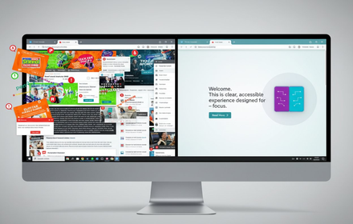

<div align="center">

# CogniRead

**Adaptive Reading Assistant for Cognitively Accessible Web**

[](LICENSE)
[](https://developer.chrome.com/docs/extensions/)
[](#)
[](#chrome-ai-apis)
[](#privacy--security)
[](https://github.com/2squirrelsai/cogniread/pulls)

<br />



<br />

*Transform any webpage into a cognitively accessible reading experience — powered entirely by on-device AI.*

[Getting Started](#installation) &nbsp;&bull;&nbsp; [Features](#features) &nbsp;&bull;&nbsp; [Usage](#usage) &nbsp;&bull;&nbsp; [Privacy Policy](PRIVACY_POLICY.md) &nbsp;&bull;&nbsp; [Contributing](#contributing)

</div>

---

## The Problem

**15-20% of the population** has a learning difference such as ADHD, dyslexia, or autism. The web is designed for neurotypical readers, and most accessibility tools focus on visual or auditory impairments — leaving cognitive accessibility almost entirely unaddressed. Students and professionals with these conditions spend **3-5x longer** reading and frequently miss key information.

## The Solution

CogniRead is a Chrome extension that analyzes page complexity in real time and adapts content to fit each reader's needs. It combines multiple Chrome built-in AI APIs to simplify text, reduce distractions, and surface key information — all **without sending a single byte to an external server**.

---

## Features

### Reading Modes

| Feature | Description | Shortcut |
|---------|-------------|----------|
| **Focus Mode** | Highlights one section at a time, dimming surroundings to reduce distraction | `Ctrl+Shift+F` |
| **TL;DR Mode** | AI-generated bullet-point summaries of long paragraphs | `Ctrl+Shift+T` |
| **Distraction-Free Mode** | Clean reader view — strips ads, sidebars, and navigation | `Ctrl+Shift+D` |
| **Dyslexia-Friendly** | OpenDyslexic font, increased letter/line spacing, reduced visual stress | — |

### Text Transformation

| Feature | Description |
|---------|-------------|
| **Simplification Levels** | 5 levels of complexity: Off, ELI5, ELI10, ELI15, College |
| **Sentence Restructuring** | Breaks complex sentences into simpler structures |
| **Active Voice Conversion** | Converts passive to active voice for clearer communication |
| **Tone Adjustment** | Casual, Formal, Encouraging, or Neutral tone options |
| **Text Expansion** | Automatically expands abbreviations and acronyms |

### Comprehension Aids

| Feature | Description |
|---------|-------------|
| **Word Definitions** | Hover over difficult words for instant, context-aware definitions |
| **Literal Language** | Converts idioms and figurative language to literal meanings (100+ idioms) |
| **Plain Language Translation** | Converts legal, medical, or academic jargon into plain English |
| **Prerequisites Check** | Identifies prerequisite knowledge needed before reading an article |
| **Reading Goals** | Surfaces learning objectives, difficulty level, and estimated reading time |
| **Difficulty Heatmap** | Color-coded visualization of cognitive load across sections |

### Progress & Analysis

- Visual reading progress bar with completion percentage
- Flesch Reading Ease scoring and cognitive complexity rating (1-10)
- Reading time estimation

---

## Chrome AI APIs

CogniRead leverages Chrome's built-in AI for fully on-device processing:

| API | Used For |
|-----|----------|
| **Summarizer API** | TL;DR summaries and key point extraction |
| **Rewriter API** | Text simplification, sentence restructuring, tone adjustment |
| **Prompt API (Gemini Nano)** | Definitions, cognitive analysis, difficulty heatmaps |
| **Translator API** | Literal language conversion for idioms and figurative speech |

> All AI inference runs locally on your device. No data leaves your browser.

---

## Installation

### Load as Unpacked Extension

```bash
git clone https://github.com/2squirrelsai/cogniread.git
```

1. Open Chrome and navigate to `chrome://extensions/`
2. Enable **Developer mode** (toggle in top-right corner)
3. Click **Load unpacked**
4. Select the cloned `cogniread` directory

### Enable Chrome AI APIs

Chrome AI features require Chrome Canary or Dev channel:

1. Install [Chrome Canary](https://www.google.com/chrome/canary/)
2. Enable `chrome://flags/#optimization-guide-on-device-model`
3. Enable `chrome://flags/#prompt-api-for-gemini-nano`
4. Restart Chrome

> CogniRead works without AI APIs enabled — features degrade gracefully to local fallback algorithms.

---

## Usage

1. Navigate to any webpage with text content
2. Click the **CogniRead** icon in the toolbar and press **Activate on this Page**
3. A floating control panel appears on the page — toggle features as needed
4. Use keyboard shortcuts for quick access

### Keyboard Shortcuts

| Action | Shortcut |
|--------|----------|
| Toggle Focus Mode | `Ctrl+Shift+F` / `Cmd+Shift+F` |
| Toggle TL;DR Mode | `Ctrl+Shift+T` / `Cmd+Shift+T` |
| Toggle Distraction-Free | `Ctrl+Shift+D` / `Cmd+Shift+D` |
| Navigate sections (Focus) | `Arrow Left` / `Arrow Right` |
| Adjust font size (Reader) | `+` / `-` |
| Exit current mode | `Escape` |

---

## Architecture

```
cogniread/
├── manifest.json            # Extension config (Manifest V3)
├── content.js               # UI orchestration and feature toggles
├── ai-service.js            # Chrome AI API wrapper with fallbacks
├── cognitive-engine.js      # Content analysis and complexity scoring
├── prompt-api-service.js    # Prompt API integration layer
├── idioms-dictionary.js     # 100+ idioms for literal translation
├── background.js            # Service worker for extension lifecycle
├── styles.css               # Accessibility-focused stylesheets
├── popup.html / popup.js    # Extension popup interface
├── demo.html                # Interactive feature demo page
└── icons/                   # Extension icons (16/48/128px)
```

**Three-layer design:**

1. **AI Service Layer** — initializes Chrome AI APIs, manages sessions, provides graceful fallbacks when APIs are unavailable
2. **Cognitive Engine** — extracts page content, calculates readability metrics (Flesch score, syllable count, sentence complexity), chunks content for focus mode
3. **Content Script** — orchestrates UI, manages feature state, handles keyboard shortcuts, and coordinates between the AI and engine layers

---

## Privacy & Security

| | |
|---|---|
| All processing on-device | No external API calls |
| No user tracking or analytics | No personal data collection |
| No cookies or third-party scripts | Open source and auditable |
| GDPR and CCPA compliant | Zero server infrastructure |

CogniRead has **no servers**. Your reading habits, preferences, and page content never leave your browser. Chrome's `storage.sync` API stores your feature preferences locally (and across your Chrome instances if sync is enabled).

Read the full [Privacy Policy](PRIVACY_POLICY.md).

---

## Target Audience

- People with **ADHD**, **dyslexia**, or **autism spectrum** conditions
- People with learning disabilities or temporary cognitive impairment
- Non-native English speakers
- Students working through complex academic material
- Anyone who wants a distraction-free, simplified reading experience

---

## Contributing

Contributions are welcome. To get started:

1. Fork the repository
2. Create a feature branch (`git checkout -b feature/your-feature`)
3. Make your changes and test thoroughly
4. Submit a pull request

Please open an [issue](https://github.com/2squirrelsai/cogniread/issues) first for significant changes so we can discuss the approach.

---

## License

This project is licensed under the [MIT License](LICENSE).

---

<div align="center">

**Made for the 15-20% of people who think differently.**

*CogniRead — because everyone deserves to understand the web.*

<br />

Built by [2 Squirrels AI](https://github.com/2squirrelsai) &nbsp;&bull;&nbsp; Powered by [Chrome Built-in AI](https://developer.chrome.com/docs/ai/built-in)

</div>
